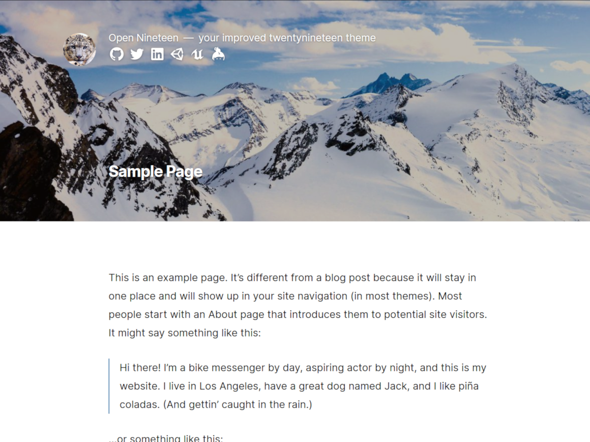

> [Current Version](../../releases/latest)

# Deprecation note ⚠

Seems like the general interest on the project was quite low and since I'm moving away from the theme now as well, I will archive the repo now. It worked fine until the end, but since the theme is not customizable through the gutenberg blocks (you can still use them in posts and pages, just not for the theme itself), this theme is missing out on cool new features that were added to wordpress in the last years.

# Introduction

The wordpress [twentynineteen](https://wordpress.org/themes/twentynineteen/) theme is a beautiful fully functional theme with gutenberg support. This repository is a standaolone fork of the theme with some design changes. This theme is ment for personal light and elegant websites. [Example](https://deml.io)

### Implementation Decisions

* Create a standalone repository to enable easy maintanance and forkability for the theme
* Keep an extra branch vanilla-twentynineteen to merge changes from the parent theme
* Use npm with build scripts as the [wordpress main repo](https://github.com/WordPress/wordpress-develop), to support easy access and scss.
* No dependencies to google fonts or alike, focus on privacy

### Design Decisions

* Use only one font: [Inter](https://rsms.me/inter/)
* Support for [variable fonts](https://en.wikipedia.org/wiki/Variable_fonts) keeps the font downloads small
* Remove elements like previous and next entry
* Remove author information
* Get rid of oversized headings
* Add of some additional css classes for easy styling
* Match Preview image size for archive lists to text width to use less space for each entry

## Build Project

```shell
npm install
npm run build
```

## Contribute
Let's push this together to have an open community version of twentynineteen. Post and issue or create a PR, I'm happy to discuss any changes.

## Licence

* [LICENSE](./LICENSE) - Open Nineteen Theme, © 2019-2020 Johannes Deml, GNU GPL
* Twenty Nineteen WordPress Theme, © 2018 WordPress.org, GNU GPL
* Inter Font, © 2016-2019 The Inter Project Authors (me@rsms.me), SIL OPEN FONT LICENSE Version 1.1
* normalize.css, © 2012-2018 Nicolas Gallagher and Jonathan Neal, MIT
* Underscores, © 2012-2018 Automattic, Inc., GNU GPL v2 or later
